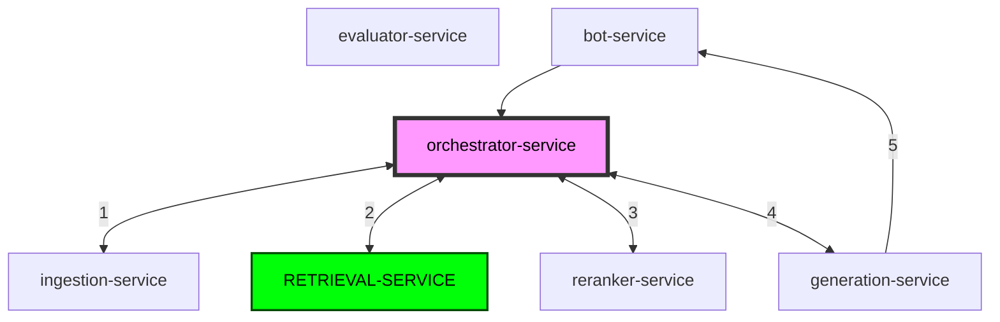

# RETRIEVAL-SERVICE 
- Сервис для поиска информации в векторной базе данных, различные методы для поиска

```mermaid
graph TD
    K[evaluator-service]
    
    
    F[bot-service] --> c[orchestrator-service]  
    c <--1--> B[ingestion-service] 
    c <--2--> G[RETRIEVAL-SERVICE]
    c <--3--> E[reranker-service]
    c <--4--> I[generation-service]
    I --5--> F
    
    
    style c fill:#f9f,stroke:#333,stroke-width:4px,color:#000
    style G fill:#00ff08,stroke:#014a04,stroke-width:2px,color:#000
```
